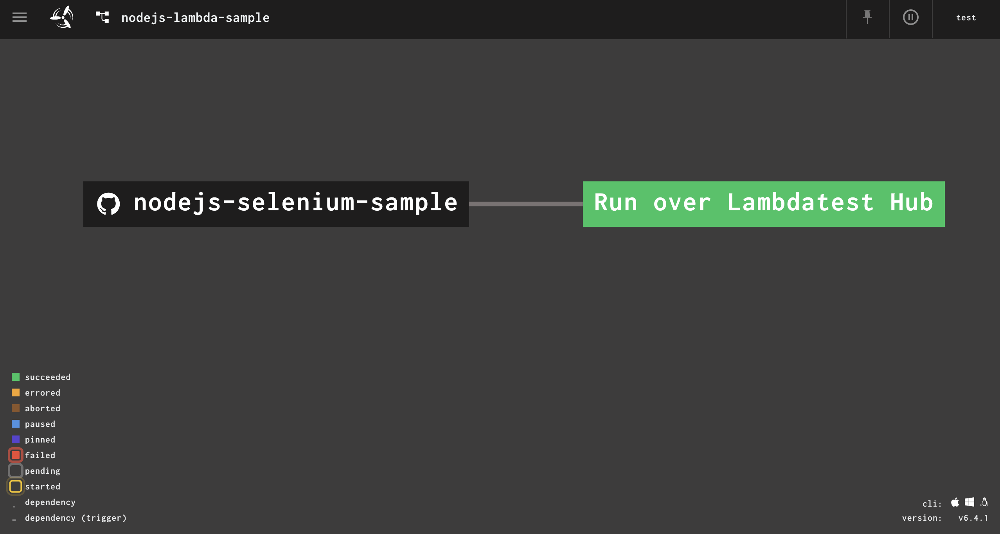
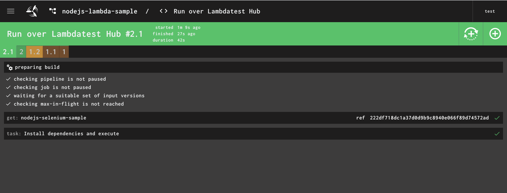

# NodeJS Automation — TestMu AI (Formerly LambdaTest)
NodeJS selenium automation sample test for TestMu AI Cloud GRID.

### Install Node package manager
- Download & Install node package manager from
   https://www.npmjs.com/get-npm

### Install Dependencies
```
npm i
```

### Configuring test.

Set TestMu AI Username and Access Key in environment variables.

**For Linux/macOS**
 
```
export LT_USERNAME="YOUR_USERNAME"
export LT_ACCESS_KEY="YOUR ACCESS KEY"
```

**For Windows**

```
set LT_USERNAME="YOUR_USERNAME"
set LT_ACCESS_KEY="YOUR ACCESS KEY"
```


 **Tip** : List of supported platfrom, browser, version can be found at https://www.testmuai.com/capabilities-generator/


### Executing test
```
node index.js
```


## Execute using Concourse-CI Pipeline

#### Pre-requisites for concourse-ci 
- install and start `concourse` server [http://127.0.0.1:8080](http://127.0.0.1:8080)
- install `fly` cli tool, if already installed check version using,
```sh
$ fly -v
6.4.1
```
#### Configuring Pipeline
- open terminal
- login to concourse server and save the target using,
```sh
$ fly -t ci login -c http://127.0.0.1:8080 -u test -p test
logging in to team 'main'

target saved
```

- go to the `project-folder/concourse-ci`
- you will see YAML file `pipeline-config.yml`

```yaml
resources:
  - name: nodejs-selenium-sample
    type: git
    icon: github
    source:
      uri: https://github.com/LambdaTest/concourse-nodejs-selenium-sample.git

jobs:
  - name: 'Run over Lambdatest Hub'
    public: true
    plan:
      - get: nodejs-selenium-sample
        trigger: true
      - task: 'Install dependencies and execute'
        config:
          platform: linux
          image_resource:
            type: registry-image
            source: { repository: node, tag: "12" }
          inputs:
            - name: nodejs-selenium-sample
          run:
            path: /bin/sh
            args:
              - -c
              - |
                cd nodejs-selenium-sample
                npm install
                export LT_USERNAME=username
                export LT_ACCESS_KEY=accessKey
                node index.js
```

- update env `LT_USERNAME` and `LT_ACCESS_KEY` values in `pipeline-config.yml`
- create concourse pipeline using,
```sh
$ fly -t ci set-pipeline -p nodejs-lambda-sample -c pipeline-config.yml
```
- run `nodejs-lambda-sample` pipeline using concourse web UI






## 🚀 LambdaTest is Now TestMu AI

👋 Welcome to TestMu AI, the next evolution of LambdaTest. As of January 2026, [LambdaTest is Now TestMu AI](https://www.testmuai.com/lambdatest-is-now-testmuai/) - we have evolved from a cross-browser testing cloud into a unified, AI-native quality engineering platform designed for the modern DevOps era.

Whether you have been part of the LambdaTest community for years or are just discovering TestMu AI, our mission remains the same: to help you ship faster with high-scale test execution, autonomous testing, and deep quality analytics.

### 🔄 Our Rebrand Journey

In 2017, we introduced LambdaTest with a clear mission: to become the world's most trusted cloud testing platform. We built a scalable, high-performance test cloud that eliminated flakiness, improved developer feedback cycles, and accelerated release velocity for teams worldwide.

As LambdaTest grew, we expanded the platform into Test Intelligence, Visual Regression Testing, Accessibility Testing, API Testing, and Performance Testing, covering the entire testing lifecycle. These capabilities enabled teams to test any stack, on any technology, at enterprise scale.

Over time, we rebuilt the architecture to be AI-native from the ground up. What began as LambdaTest's high-performance testing cloud has now evolved into TestMu AI, an AI-native, multi-agent platform redefining modern quality engineering.

We chose the name TestMu AI to reflect our shift towards intelligent, autonomous testing. While our identity has changed, our core technology and commitment to the testing community stay the same.

👉 Find [LambdaTest's New Home](https://www.testmuai.com/).

### 🔭 Explore TestMu AI

The same infrastructure LambdaTest customers relied on, now delivered through autonomous AI agents.

- [KaneAI](https://www.testmuai.com/kane-ai/)
- [Agent-to-Agent Testing](https://www.testmuai.com/agent-to-agent-testing/)
- [HyperExecute](https://www.testmuai.com/hyperexecute/)
- [Real Device Cloud](https://www.testmuai.com/real-device-cloud/)
- [Pricing](https://www.testmuai.com/pricing/)
- [Documentation](https://www.testmuai.com/support/docs/)