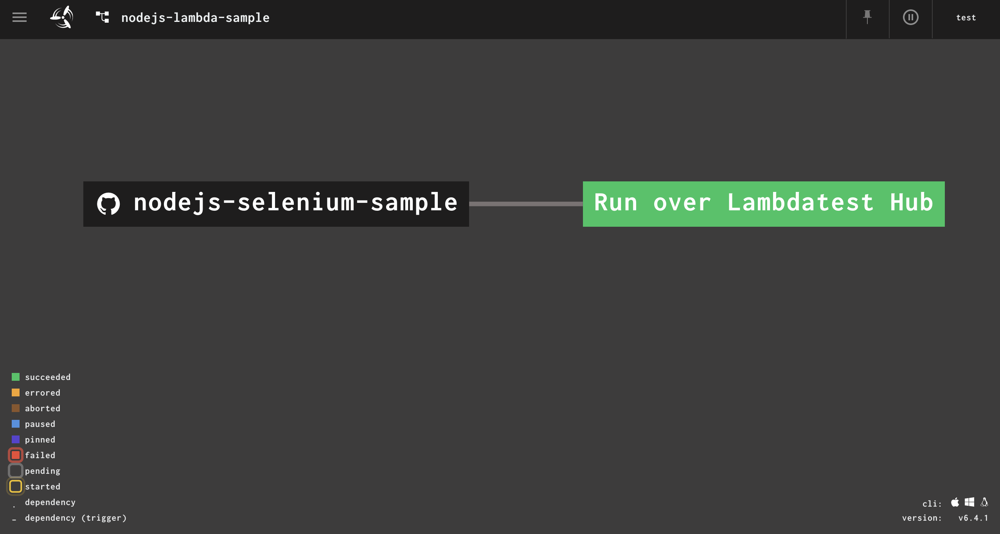
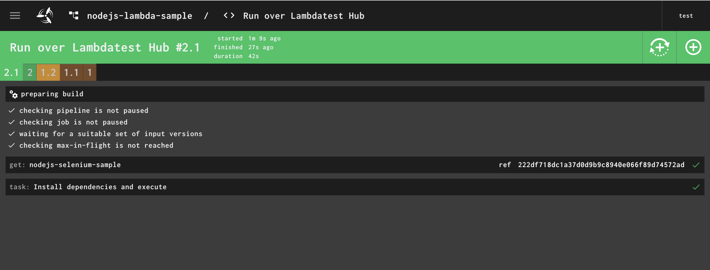

## NodeJS Automation Lambdatest
NodeJS selenium automation sample test for Lambdatest Cloud GRID.

### Install Node package manager
- Download & Install node package manager from
   https://www.npmjs.com/get-npm

### Install Dependencies
```
npm i
```

### Configuring test.

Set LambdaTest Username and Access Key in environment variables.

**For Linux/macOS**
 
```
export LT_USERNAME="YOUR_USERNAME"
export LT_ACCESS_KEY="YOUR ACCESS KEY"
```

**For Windows**

```
set LT_USERNAME="YOUR_USERNAME"
set LT_ACCESS_KEY="YOUR ACCESS KEY"
```


 **Tip** : List of supported platfrom, browser, version can be found at https://www.lambdatest.com/capabilities-generator/


### Executing test
```
node index.js
```


## Execute using Concourse-CI Pipeline

#### Pre-requisites for concourse-ci 
- install and start `concourse` server [http://127.0.0.1:8080](http://127.0.0.1:8080)
- install `fly` cli tool, if already installed check version using,
```sh
$ fly -v
6.4.1
```
#### Configuring Pipeline
- open terminal
- login to concourse server and save the target using,
```sh
$ fly -t ci login -c http://127.0.0.1:8080 -u test -p test
logging in to team 'main'

target saved
```

- go to the `project-folder/concourse-ci`
- you will see YAML file `pipeline-config.yml`

```yaml
resources:
  - name: nodejs-selenium-sample
    type: git
    icon: github
    source:
      uri: https://github.com/LambdaTest/concourse-nodejs-selenium-sample.git

jobs:
  - name: 'Run over Lambdatest Hub'
    public: true
    plan:
      - get: nodejs-selenium-sample
        trigger: true
      - task: 'Install dependencies and execute'
        config:
          platform: linux
          image_resource:
            type: registry-image
            source: { repository: node, tag: "12" }
          inputs:
            - name: nodejs-selenium-sample
          run:
            path: /bin/sh
            args:
              - -c
              - |
                cd nodejs-selenium-sample
                npm install
                export LT_USERNAME=username
                export LT_ACCESS_KEY=accessKey
                node index.js
```

- update env `LT_USERNAME` and `LT_ACCESS_KEY` values in `pipeline-config.yml`
- create concourse pipeline using,
```sh
$ fly -t ci set-pipeline -p nodejs-lambda-sample -c pipeline-config.yml
```
- run `nodejs-lambda-sample` pipeline using concourse web UI






## About LambdaTest

[LambdaTest](https://www.lambdatest.com/) is a cloud based selenium grid infrastructure that can help you run automated cross browser compatibility tests on 2000+ different browser and operating system environments. LambdaTest supports all programming languages and frameworks that are supported with Selenium, and have easy integrations with all popular CI/CD platforms. It's a perfect solution to bring your [selenium automation testing](https://www.lambdatest.com/selenium-automation) to cloud based infrastructure that not only helps you increase your test coverage over multiple desktop and mobile browsers, but also allows you to cut down your test execution time by running tests on parallel.
